# Use cases

Seven walkthroughs, each built around a real question and a structure anyone can load. Every one has an
**Open this example** link that opens the live viewer in exactly the state shown in its screenshot — the
same models, colours, labels, camera and panels — so you can follow along, or just poke at the result.
The examples fetch their structures from the RCSB PDB and the AlphaFold Protein Structure Database, so
they need a network connection; files you open yourself never leave your computer.

Screenshots follow your light or dark theme. The viewer has both: the button beside **Help** switches
between **System** (the default, which follows your operating system and changes when it does),
**Light** and **Dark**.

| I want to… | Walkthrough | |
|---|---|---|
| know which parts of an AlphaFold model I can believe | [1. Check an AlphaFold prediction](#1-check-an-alphafold-prediction) | [Open example ↗](https://mbaffour.github.io/protein-structure-viewer/#scene=z.fVRNb-M2EP0rweylBShDkvVh6-akCHpo0WCz2EMXOdDUSGKXIlWScuIG-e_FULSzdrdrX0TO15s3w_cK_jghNDBZ41Hq5CDxGW3iBGoEBk4MOPLPaJ00GpqMweJwvoF8VVSrNTAQFrnHdufpMs2rJN0mWf0pq5uiatLtaltmf1LGgVtsofF2RkZlD6i5FgjNK3jpFYEhNzNbEb9H9INpl29tPDr6fGMwmhaVg-bLK2g-kvPuPnlIi2pdJ_fZSsgOGHToxXBlAmrDyT0VW3AIo4yFBj5s9qXoKmCg-B4VEVOub37aqWng90a1PwODQbYt6ruBS03Fn96eGDj0XureURfE0O-mJTxO6l4RjxYniw61536hTXDrjdEQS0f_SbWth9jZH7ZFwqQMb7EFBlzJXo-o_Sk7_j0jUfeNaTdNShK_HVcOGXDh5QEpQH2fH4sdWsryAx-u1Ed0sp3xN2LFnbNP1vyFIrY0oXUThnrAwMxeSU0wtQmr1Jn-HBfIffTHMO29eQntKexRtw_GyZhwb7w3Y6KwI05EIPz2-O4Qk3XSPwoTtpgrBeHiI_ZLDmAwxYC72Zuug6Ykj36252Ze32L2OxpFvFhcbmepwhReaU7zSBOHnNDwiXK6BeYQ4HuPFL1s1NLN-citGKRH4WeLEfm5yCccJ8V9eAIf-umQTFyjSi4LBsN-gZP8t_qF-QrKle0C14XtOyCjB75MxvpkjGtqpfanouGQPMvW0zPL6s2lQczOm5EseXpp4WFbyLIqLy3tJKGBdXoV4PGF3M8FIign_yFQ2SZNX7L8PehkFjys2ZlEOfIek87YkVO6SfdXEQtFFwwtV8n0f8sZnEKlZM_p0Z5RLCNOOqOp2M5KrtjNr6gO6KXg7MZx7RKHVnYkaXsuvvbWzFQevOXaTdxiIPvddHcSqy78FknCW1TmGZqUwYAerSGB8FJ8JTGdbcfFN2_Rkf_xUbbvY3ZHLaKuWBNlira48z8QBmFGwvdA-xq0kB7GiJZD8yXJV3m2TYuyyIvNuqrSomRJtsqzsqiKtMzzTV3WRcXqVVqV6zwtN5t8XebbLUvydb2q8jrLNuWmrIttXbM0_LOntygesZpDtehPPI_I3WyRlDDe2EW4fuGeQ6NnpRi0ZjxpNwOudWw3XpxmfKrAD9h-lvi8aP2_) |
| see how close a prediction is to an experimental structure | [2. Compare a prediction with experiment](#2-compare-a-prediction-with-experiment) | [Open example ↗](https://mbaffour.github.io/protein-structure-viewer/#scene=z.fVRNb9s4EP0rwfRKCZJsfd5iF0EOXWzQFD1skQNNjSxuKVIlKSfeIP99MZTsxGl2daLm6z3ODN8z-OOI0MBojUepo4PER7SRE6gRGDjR48C_o3XSaGhSBnPA2QJZvC7iFTAQFrnH9tqTMcmKKKmjtPyWls26apIkLqrVX1Sx5xZbaLydkBHsATXXAqF5Bi-9IjIUZiYrlvOAvjftfNbGo6PjC4PBtKgcND-eQfOBgtd9v4uF7IBBh170iwmItpM7Kj7jCqOMhQY-1Wu-2lXAQPEdKoq_vd1cCXt0nitg0Mu2Rb3tudSEBBtgsAUGn-HhhZ1xr2-iu6Kukzy6Sd_hv3X9D48urzHZveFxrcae3xjV_k7i4eWBgUPvpd476hvN5A_TEhNzQKv4ERhYHC061J77eVKCW2-MhgV1SXDeTsJPlqYdGvqnbZEoKcNbJHSu5F4PqP0pA39NSBN747oeRyVfx8qFlwekeHU5FYsdWkr-wMeV-opOthN-oR44aDqu3Lwkf6NYbjGidSOG-sDATF5JTay0CQvbmf05L7Ty3h_DTu3MU7iNwj3q9s44uRTcGe_NECnsPLUmNHlzfA1YinXS3wsT3gpXtBmd9F9xP9cABuOSsJ286TpocorYT_Z8meeXpfqWur8Y5pDNJFVo-jONZhpoypARGz5STTfT7AN975Gy50bPtzn_cit66XGe58z8DPINh1FxHx7ap_14iEauUUWXgMGxm-lEv6NfuN9Reee74HXh-4DkEoFPo7E-GuY9G63U_gQafqJH2Xp6VGlZXTrE5LwZyJMllx4etoU8cX7paUcJDaySdwkenyj8DLCQcvIfIpVWSfKUZq9JJ7fgYc3OTZQD32PUGTtwKjfq_buMuUUXHZpN0fhfyxmCAlK04_RGzyzmEUed0QR2bSVX7OoW1QG9FJxdOa5d5NDKjoRzx8XPvTUTwYO3XLuRWwzNfnVtz9IUvlmGcIPKPEKTMOjRozVBQaT4SZI92Y6LN2_RUfzxXravY3ZHLRYZsWZRJtrizn8gCMIMxOuO9jToHj2IAS2H5keUZnGVpmWW5XlZ1Hm1qliUruMsL-qqqquyXBdpXrJoVcVpUuRFmdRlVaVVmrMqLvJ8XedZUZZFXa5YwpK4LvI6y6usyKo6KfOCJSxK4iyvqrRO1nmaZHmW5Q8vi6wsfByqWZmW_wG5myySJC4WO0vaZ-45NHpSikFrhpOSM-BaL41YDKfpnxD4AdvvEh9n5f8X) |
| understand how a complex is put together | [3. Explore a complex](#3-explore-a-complex) | [Open example ↗](https://mbaffour.github.io/protein-structure-viewer/#scene=z.jVVLb9w2EP4rweTSAtRC1GP1uNnOwYcWDZIghwY-cKmRxIYiVZLyo4b_ezCUdu113KK7F3Ge33wzHD5CeJgRWpidDahMcqvwDl3iJRoEBl6OOImv6LyyBlrOYDU4SSDbFftdDgykQxGwuwgkTLN9kjYJr77wqi3qtih2TdX8SRFH4bCDNrgFGaW9RSOMRGgfIaigCQyZ2cXJ7XvCMNpu_TY2oKfPJwaT7VB7aL89ghETGRfjeNhJ1QODHoMcNxEQbK8OFHzNK622Dlp4Xx9K2e-BgRYH1NDCtcDJDtoelHn3S3F9ffkrMBhV16G5GoUylO_m6YaBxxCUGTwBJ1J-tx1B8MoMmqhzODv0aIIIK1NSuGCtgS37Zi8pKGzF_OE6JFjaig47YCC0GsyEJhyj498LElsvVBfzrBVR2gvtkYGQQd0iOehzShz26Mj7DZ3Q-hN61S34GxHhT9FmZ_9CuZUwo_MzxvjAwC5BK0OwjI3T0tvh5Bf5_BweYkMP9j6Wo3FA0320Xm0BDzYEOyUa-0C8RIIvH54NtmC9Cp-ljYMqtIYo-ITDGgMYzJvD1RJs30NbksWwuFMxj09b9CuiPvbsgtqPnHdFDQyu6NQfKl6XwOCSTmlWF7ICBh_olNeHrq9p7NbIl4vSsVmP1M5losGAjIoQM0Hxa3VjrDoEpKTr7K0knI7CyVEFlGFxuBV8SvIFp1mLEC_H-2G-TWZhUCfnCaPisMJJfs5-pn4F5ZXuDNeZ7g2QmwXez9aFZFrnc3bKhGPSeEjuVBfoIvKqPlfIxQc7kSZLzzUiDhlpduW5ppsVtJCnrxwC3pP5KcEGyqt_CBSv0_SeZ89OR7UUcTpPJKpJDJj01k2Cws1meOWxUnTG0CpK5n-b6WgUMyUHQXf7hGJtcdJbQ8kunBKavbtGfYtBScHeeWF84tGpnqbuIOT3wdmF0kNwwvhZOIxkP6uujmutj791c-ElansHbcpgxIDO0h4JSn6nNbu4XsgXV9iT_cNn1T232T8Yua0fZ7dtRlPchzf2iLQT4fpIcxpXJV2ICZ2A9lvC011eNFVepEVRVU2WZizh-S4r91leFmlRN_u8Zkne7Jq8LPf7uiyaJi0LluzTXVrkVVllTV7u9zlL45_fPG2bZsvlUa_Lan0WpjcAxn3bwkVciHHjkW2espyzvGB5yfI942nOeFowntJ3xThPGeeccZ4zzgvGOclqxnnDeJYynmWMZznj2f5m3cBxFEY1jFoNY4AXT04vpOQlPLH_xHf5M758w1dyVpaMpzXjabPByhjnJeN8_wakgvGsZDyrGM9qxnP-vyHe0OMr_OKQHpqN4w3VBxEEtGbRmkFnp-PTyEAYs43JJjjejWOPxC12XxXerU_pDw) |
| mark up domains and key residues | [4. Annotate domains and residues](#4-annotate-domains-and-residues) | [Open example ↗](https://mbaffour.github.io/protein-structure-viewer/#scene=z.nVdNj9tIDv0rQc1lFnhuFMn69K3T2WAPu9ggacxhgxzUctmtGVnySnIn2Ub--4CSupPOJgEm9kUqsshXJN8r-95MH0_FbM1p6KfSdJu7prwvw2asS1cMzFjflmP1WxnGpu_MlmAWh8cVwxcuXIiBqYdSTWV3Oemi5bCxeUPxmuLW5a24i-joPxrxthrKzmyn4Vygae9KV3V1Mdt7MzVTq2DUrT8P9fp8LNNtv1ueu34qoz5-gjn2u9KOZvv23nTVUZ0vX25eWRckbl7SRd3sDcy-TPXtVyajxxibG0224Kj7th_M1vySbny9DwamrW5Kq4Xx8uzXy_Z0W73s293fDMxts9uV7uq2ajpN_u7TO5ixTFPTHUY9hVboX_1O8YxNd2i1jkM5DWUs3VRNS9nqapj6vjNr6tW_6rp-0iqa9XT_HnZFcbV9tZtXq7Y5dMfSTQ8Zyn_PRcv3henydGobrfG-ascCU9VTc1d0Q_vtGg1lXwaN8gOfqm1fl7HZncs_tTLjY_TT0P9e6vVYpzKMpzLnMzD9eWqbTmF2_TxO-_7wuG8u8Jvp49zxm_7DfLy2HEq3e9WPzRrwpp-m_rhpy37SWs1Ff_7xs8MabN9Mb-p-nuSqbc288LoclhgG5rRuuDpP_X5vtl49Dufh8TD3n9boV9qOdWFxeX5u2rkL99qr81G7bljRVCeNOS4wb2f401R09zJVy2keX6uhvm2mUk_noazIH5Ncl-OpraaZBr8cTnebU9WVdvM04Wy4WeBs_j_7E_NXUL6yPcH1xPYNkKtH-XDqh2lzXAbvNDTd9JB0ftm8b3aTUo1iemqoz-PUH9XC9qmlmqdFLRf-qWV3aszWiP1qw1Q-qPtjghXU2PxPQVGy9gPx500P5rqax-yxiM2xOpTNvh-OlYY7dYevdiwlelKhZWlz-t5wzk5zps1NpaR9RLG0eLPvO012OTRVi2f_KO1dmZq6wrOx6sbNWIZmr7J2U9V_HIb-rOnNNFTdeKqGMhf7s-nqQbD282eRpfK8tP17s7Uwt2UqQ68CMTX1Hyqo52Ff1V9wcVT_j2-a3ec2jx-7etWVoV-lSqd4P_1AGOr-qPhe6bzOeqjEOJahMtu3G75gytZ5xy5JCNZ5bOiCybvgrGdO0UcXEC9s8MLWp8TiOWdsWOJF4EiUfPLR5Rhh5y-9-7SKxyL9xx9AU0Krada4sTFbih6mWobxSpfXeXpN0ZtP-IvR2KVvR2OXfiJalO9Ei2KWS6ZdhHYt87FU43koKvnryrAo9Itqqsy2O7ctzK4_rhfV4y15ffnCfHHlFaKdS9-AtDvrVfuWwBA4eAREJGSQBRGIQQJyIA8KoAhKoAy2YAIzWMAO7MEBHMEJnCEWQhCGCMRBPCRAIiRBMpyFIziGEzgH5-ECXIRLcBnewhM8wwu8g_fwAT7CJ_iMYBFIy7ReBOtPCHy_C9qitSavXr_-siZ7n4u9-X5NgkPwCAEhIiSEjGgRCZERBdEhesSAGBETYkaySITESILkkDxSQIpICSkjW2RC5p8F_-L5k4ayD1J-AD47ZI8ckCNyQtaGWpAlkGWQFZB1IOtBNoBsBNkEshk0d55A2nttvnZf26_91wHQCaAMYgtiHREGsYDYgdiDOIA4gjiBOIPEgoRAorMkIHEg8SAJIIkgSSDJIGdBjkCOQU6HzoGcB7kAchHkEshlkLcgTyDPIC8gr9PpQT6AfAT5BPIZFCwoECgwKAgoOFDQMQ6gEEEhgUIGRQuKBIoMigKKDiohFHXeIygmUMygZEGJQIlBSUDJgZIHpQBKSowEShmULSgTKDMoCyg7UPagHEA5grIySClkwZbAlsFWwNaBrQfbALYRbBPYZjAp1whMDCYBkwOTB1MAUwRTAisllZMzKRmstFReKjGVmUpN5SZnsFiwEFiUvQIWBxYPlgCWCJYElgx2FuwI7BjslOYO7DzYBbCLUGFkl8Hegj2BPYO9gL3qgQf7APYR7BPYZ3Cw4EDgwOAg4ODAQYUjgEMEhwQOGRwtOBI4MlQuOTpw9OCoChPBMYFjBicLTgRODE4CTg6cPDgFcFIpSuCUwdmCM4F_nnvXf7_-knsUKnHV97kn7CEcIBwhnCAqiaqJKoqzKgpEdVGFUZVRpVG1UTLEWYgjiGOIU_l0EOchLkBchLgEcRniLcQTxDPEC8SrznqIDz97yqvrJwqTRaT86JTBQYJKe4CECAkJEjIkWkgkSGRIFEh0kOghUe-ACIkJEjMkWUgiSGJIEkhykOQhKUCSXhYJkjIkW0gmSGZIlr92und4-L_1-Up9-HG3vo7VXdn91pT3yx-9PwE) |
| make a figure at the journal's size and resolution | [5. Build a publication figure](#5-build-a-publication-figure) | [Open example ↗](https://mbaffour.github.io/protein-structure-viewer/#scene=z.7VbNbtw2EH6VxfjSApSgf2l1s52DDw0axEEODXzgSqNdNhSpkpR_6vidmjxCH8DPVAyl3Y1cN2iBpr1kT-IMOTP85uM3ew_ubkCoYTDaoVDBtcAbNIFtUCEwsM0Oe_4WjRVaQR0zmDYcLJCEWRGmwKAxyB22p46MUVIE0TqIyzdxWedRnaVhkkU_UcQdN9hC7cyIjNJeo-KqQajvwQknqRjapkfTzN89up1up2-lHVr6fGDQ6xalhfrdPSje0-Zst9uEjeiAQYeu2c0moLKt2FDwKW-jpTZQw0m1yZuuAAaSb1BCDRcce72VeiPU6rvs4uLse2CwE22L6nzHhaJ8Vw9XDCw6J9TWUuEEykvdUglWqK0k6AwOBi0qx92EVMON01rBnH3e31BQmC_zo2mRypKat9gCAy7FVvWo3D46_jIiofWZ63QYpCBIOy4tMuCNE9dIB-QSEoMdGjr9jI9L-RqtaEf8gYCwh2iD0T9jM19hQGMH9PGBgR6dFIrKUtqzpdPbwzmP56W78w3d6Ft_HYlbVO0rbcUccKOd030gsXOEiwf47O64YQ7WCXfZaE9ULiV4w2vcTjGAwTAfOB-d7jqoc9qxHc3hMvdT7A97hl2Om1GJQ84Pp1DD48f4sD6j9afj-tz7k8P6hfcnxEJvOKeO-jwU6QTjuM0qYEDnTrpNGVc5MKCoJ1FSZU0JDCjGSVpt2q6iOFPBZ6OQngP3xJKxJ76Bf158oBvaCbSdB9M5pKQTpSdsD0tump1w2LjR4IzjIckb7AfJnX9zJ9vhOhi4QhksE3rHZion-HP2hftJKU98i7oWvmeKnHfg7aCNC_qJ9oMRyu2T-kVwI1pH77sZrdP90jfbaoirdOnhnr7kCfOlpx0EXTyKlmaHt7S9hGVdVvyKPn4U3cbJ8dDe3XBPs2RvFz3fYtBp03MKN6jtkxMTSguQJlMw_NVr8Zt8pmDDSTXiQxlTm4NOK8p2agSXbHWB8hqdaDhbWa5sYNGIjpi34c37rdEj5Ycbagh8bjzfa2Xnf5Mc4hlKfQN1xGCHDo0mcXKieU_aPZqON5_pgqX9d5eiPTbZ3qlm1jSjZ4kkDnfuGXFqdD9wg6-IpV5_6Tn0aDjU74I4CtNsXaZZlGVluU6ihAVxGiZ5kaR5FmXVukgrFqTrcJ3meVFUebZeR3nGgiIKoywt8zJZp3lRpCxiUVhGZRwVZRXHVZFnZf6csbh6mAVumj79MyV7Wa_h1OuuFVBXJQM-0fKcrDOzLoStSpgGipyEdr5ij9yOBkniZ4uZFPoFdxxqNUrJoNX9figx4ErNWM6GPXfmpeXX2L4VeLMYmm_QGULzKDKTGD5-ildctavHj8njp2TVip6e-NeDnkUsvvrC-JpH-Mv91D_6ruaR6gX4YD1OdxI-P1AX7r0m_gvD-wtD8h8_rq_wWLy8n_u2TX9f2KH59HdnNejmPbqn_V8NRt-KnsvVxNFF57MwKfJyffyxIInDvEjoIw3LdVWwPA-TPMmipMzWWVUl35r8PzWZ8qwIgUWLX1MWbFfr6PffvuKz_puK-o0T_wUnrh7-AA) |
| send a collaborator exactly what I am looking at | [6. Share your work](#6-share-your-work) | [Open example ↗](https://mbaffour.github.io/protein-structure-viewer/#scene=z.dVVNc9s2EP0rns0lnQE1_JQo3izn4EM7zcSZHJrxAQSXJBIQYAFQtuvxf-8sCMmR69oXAvvx3r5drJ7BP80IDczWeJQ6OUp8QJs4gRqBgRMjTvwbWieNhiZjsDqcbyDflNtNAQyERe6xu_Z0mebbJN0n2e5rtmuqrMnzTV7Uf1HGkVvsoPF2QUawR9RcC4TmGbz0isiQm1msiN8T-tF067c2Hh19vjCYTIfKQfP9GTSfyLkcx3YjZA8MevRijFdAtJ1sKfmKK4wyFhr4ULeV6LfAQPEWFTRwy3EygzKt1Fcfy9vbw2_AYJRdh_pm5FIT3v3LPQOH3ks9OCJOovxhOqLgpB4USWdxtuhQe-5XpQS33hgNET36C0oKsZg_bYdESxneYQcMuJKDnlD7U3b8e0FS6xfT9TwrSZL2XDlkwIWXR6QAdSmJxR4tRb9j40p9QSe7BX8nIdw522zNDxSxhBmtmzHkBwZm8UpqoqVNmJbeDOe4oOedfwoNbc1jKEfhgLr7bJyMCVvjvZkShb0nXYLAh6dXh5isl_5OmDCoXCkIF19wWHMAgzkG3Cze9D00FXkMiz0X8_wSs9-Q9KFn19R-zLKurIHBDZ36dpfVFTA40CnN61LsgMEnOhV12_U1jd2a-bBIFZr1TO1cJhoMyKkIPhMVt1Y3hqq9RwJdZ28V4XzkVozSo_CLxVjwGeQrTrPiPjyOD8N8TGauUSWXgMHQrnSS_6JfmN9QeWO74HVhe4dk9MDH2VifTOt8zlZqfwINh-RBdp4eYrarLw1icd5MZMnTSwsPQ0aWTXVp6WYJDRTpmwCPj-R-BoiknPyHSGV1mj5m-WvQySx4mM6ziHLiAya9sROndLMe3kSsEl0otF4l8__NdHAKSEnL6W2fWawtTnqjCezaSq7Y1S2qI3opOLtyXLvEoZU9TV3Lxc_BmoXgwVuu3cwtBrFfTTentdaHv3Vz4QGVeYAmZTCiR2toj3gpftKaXWzPxS9P2JH_053sXtvsnrSI68eauM1oinv_zh4RZiJen2lOw6qkBzGh5dB8T7J0U5T7XVGmZbnb7fM0Z0lWbPJqmxdVmZb1flvULCn2m31RVdttXZX7fVqVLNmmm7QsdtUu3xfVdluwNPxn9y9x00Qsh2pdVvE8IXeLRVqT8cauW-4T9xwavSjFoDPTabEz4FrHIuPFqbMnBH7E7pvEh_WH4F8) |
| compare several models of the same protein | [7. Compare many models](#7-compare-many-models) | [Open example ↗](https://mbaffour.github.io/protein-structure-viewer/#scene=z.lVVNb9s4EP0rwfRKGfqwZFs3J0WQw-42aIoetsiBpkYWtxSpJSkn3iD_vRiKdmy3DbD2hZwPvsfhzNML-P2AUMNgjUepk53EJ7SJE6gRGDjRYc-_onXSaKgzBlPA0QL5bF7NCmAgLHKPzdqTMc2rJF0l2eJLtqjLvJ6Xs6Ja_E0ndtxiA7W3IzKC3aHmWiDUL-ClV0SGwsxoRVz36DvTTGttPDpavjLoTYPKQf3tBTTvKXjedZuZkC0waNGLLpqAaDu5ocMnXGGUsVDDh-WmFG0FDBTfoKL4u7vrqwbN8x4YdLJpUN90XGrCgWtgcAMMPsLjKzuiZrzQF6hkegc1rTZVMz9BzdbFX_8XtevMJWrXmXdQ29WiyE7vmt3dfbr6HeYp1vo2ua9Wq7RMbrMLzFPXO9h5LsoST7DXauj4rVHNz-CPr48MHHov9dZRX1DP_WkaYmJ2aBUnxhYHiw61537qRMGtN4bKHlBjAt9axB61h9gwn2yDREkZ3iChcyW3miJihsN_R6SOPHGth0HJt7blwssdUrw6fwmLLVpKPvhOOpIr9RmdbEb8g2rgoG65ctMQ_IMi3mJA6wYM5wMDM3olNbHSJgxka7bHvFDKB78PM7Mxz-E2Creom3vjZDxwY7w3faKwpRKIUOTr_VtAPKyV_kGYoAUWtzLUsZX-87SuYQ0Mhph0M3rTtlCXFLId7fFCL68R4YZeIBqmkOtRqlD4F3qesaeXhpwY8YHOdBPVLlzBe6TsqdjTjY5bbkUnPQo_WozsjyBfsB8U90FMPmyHXTJwjSo5BwyOzUQn-Rn9zH1B5cJ3xuvM9wuSMQKfB2N90k-9NlgZOnMiS5vkSTY-DPNiee4Qo_OmJ0-ennt46BjyzMpzTzNIqKFILxI8PlP4ESCScvK_oCzLNH3O8rekg1vw0GrHIsqebzFpje05HTfo7UXGVKKzCk2mZPhdg4aggJRsOM3pkcX0xElrNIGtreSKXd2h2qGXgrMrx7VLHFrZ0sdhw8X3rTUjwYO3XLuB20kG3lw3R2kMv0mK8BqVeYI6ZdChR2tIE7wU3-mzNNqWi5N5dBS_f5DN2zO7vRZRSqyJ6kRd3PpfiIIwPfG6pz4N2kcD0aPlUH9LsmK2yJZpUaVZVharLGdkKvJqnq6yIpsv83lZsKRYzlblqliW5bwqVnlRsHJWLfJymVZltVjmi2zB0vDPHl-jbEQsh2pSnrjvkbvRBr2MFjtJ1kfuOdR6VIpBY_qDUjPgWsdLRsPhZQ8IfIfNV4lPk7L_AA) |

---

## 1. Check an AlphaFold prediction

*Which parts of this model can I believe?*

<picture>
  <source media="(prefers-color-scheme: dark)" srcset="images/use-cases/confidence-dark.webp">
  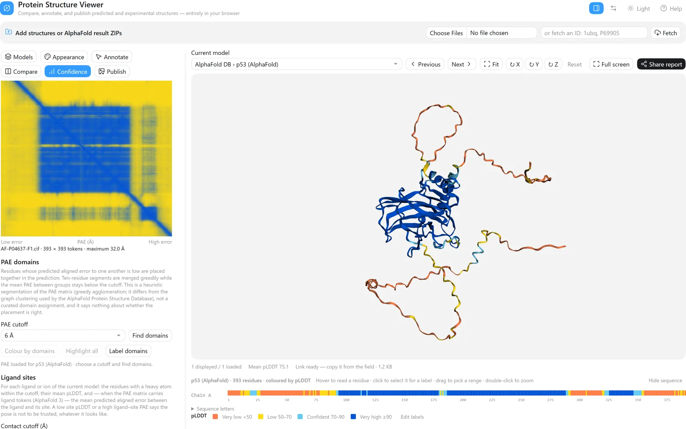
</picture>

**[Open this example ↗](https://mbaffour.github.io/protein-structure-viewer/#scene=z.fVRNb-M2EP0rweylBShDkvVh6-akCHpo0WCz2EMXOdDUSGKXIlWScuIG-e_FULSzdrdrX0TO15s3w_cK_jghNDBZ41Hq5CDxGW3iBGoEBk4MOPLPaJ00GpqMweJwvoF8VVSrNTAQFrnHdufpMs2rJN0mWf0pq5uiatLtaltmf1LGgVtsofF2RkZlD6i5FgjNK3jpFYEhNzNbEb9H9INpl29tPDr6fGMwmhaVg-bLK2g-kvPuPnlIi2pdJ_fZSsgOGHToxXBlAmrDyT0VW3AIo4yFBj5s9qXoKmCg-B4VEVOub37aqWng90a1PwODQbYt6ruBS03Fn96eGDj0XureURfE0O-mJTxO6l4RjxYniw61536hTXDrjdEQS0f_SbWth9jZH7ZFwqQMb7EFBlzJXo-o_Sk7_j0jUfeNaTdNShK_HVcOGXDh5QEpQH2fH4sdWsryAx-u1Ed0sp3xN2LFnbNP1vyFIrY0oXUThnrAwMxeSU0wtQmr1Jn-HBfIffTHMO29eQntKexRtw_GyZhwb7w3Y6KwI05EIPz2-O4Qk3XSPwoTtpgrBeHiI_ZLDmAwxYC72Zuug6Ykj36252Ze32L2OxpFvFhcbmepwhReaU7zSBOHnNDwiXK6BeYQ4HuPFL1s1NLN-citGKRH4WeLEfm5yCccJ8V9eAIf-umQTFyjSi4LBsN-gZP8t_qF-QrKle0C14XtOyCjB75MxvpkjGtqpfanouGQPMvW0zPL6s2lQczOm5EseXpp4WFbyLIqLy3tJKGBdXoV4PGF3M8FIign_yFQ2SZNX7L8PehkFjys2ZlEOfIek87YkVO6SfdXEQtFFwwtV8n0f8sZnEKlZM_p0Z5RLCNOOqOp2M5KrtjNr6gO6KXg7MZx7RKHVnYkaXsuvvbWzFQevOXaTdxiIPvddHcSqy78FknCW1TmGZqUwYAerSGB8FJ8JTGdbcfFN2_Rkf_xUbbvY3ZHLaKuWBNlira48z8QBmFGwvdA-xq0kB7GiJZD8yXJV3m2TYuyyIvNuqrSomRJtsqzsqiKtMzzTV3WRcXqVVqV6zwtN5t8XebbLUvydb2q8jrLNuWmrIttXbM0_LOntygesZpDtehPPI_I3WyRlDDe2EW4fuGeQ6NnpRi0ZjxpNwOudWw3XpxmfKrAD9h-lvi8aP2_)** — human p53 from AlphaFold DB (AF-P04637), coloured by pLDDT.

1. Type `P04637` in the box at the top and press **Fetch**. For your own run, drop the AlphaFold result
   ZIP instead: the models, their PAE matrices and the ipTM/pTM summary load together.
2. **Appearance → Colour by → pLDDT confidence.** Blue is very high confidence (≥ 90), light blue
   confident, yellow low, orange very low (< 50).
3. Open the **Confidence** tab. The table gives mean pLDDT per model (75.1 here) and, for an AlphaFold 3
   run, pTM, ipTM, ranking score and the clash flag. Below it is the **PAE heatmap**: a low-error (blue)
   block along the diagonal is a region whose *internal* arrangement is well predicted; high error
   (yellow) between two blocks means their placement *relative to each other* is not.
4. **Appearance → Hide pLDDT below 70** removes everything the model is not confident about, in the view,
   the panels and the exports.
5. **Confidence → Find domains** splits the model where the PAE says the pieces move independently, and
   **Colour by → PAE domains** paints them.

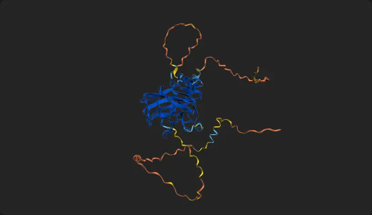

**Reading it.** p53's DNA-binding domain forms one confident block; the long N- and C-terminal regions are
low confidence because they are intrinsically disordered — the loops drawn there are not a structure to
interpret. A second, smaller block in the PAE map near the C-terminus is the tetramerisation region. A high
*mean* pLDDT never tells you two domains are arranged correctly; the PAE map does.

---

## 2. Compare a prediction with experiment

*How close is the model to the crystal structure?*

<picture>
  <source media="(prefers-color-scheme: dark)" srcset="images/use-cases/superpose-dark.webp">
  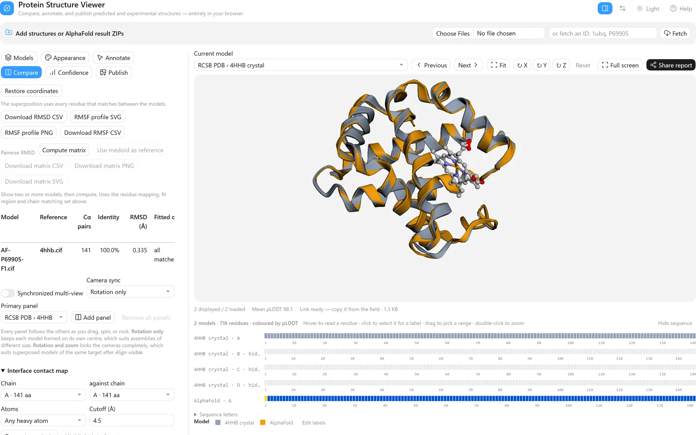
</picture>

**[Open this example ↗](https://mbaffour.github.io/protein-structure-viewer/#scene=z.fVRNb9s4EP0rwfRKCZJsfd5iF0EOXWzQFD1skQNNjSxuKVIlKSfeIP99MZTsxGl2daLm6z3ODN8z-OOI0MBojUepo4PER7SRE6gRGDjR48C_o3XSaGhSBnPA2QJZvC7iFTAQFrnH9tqTMcmKKKmjtPyWls26apIkLqrVX1Sx5xZbaLydkBHsATXXAqF5Bi-9IjIUZiYrlvOAvjftfNbGo6PjC4PBtKgcND-eQfOBgtd9v4uF7IBBh170iwmItpM7Kj7jCqOMhQY-1Wu-2lXAQPEdKoq_vd1cCXt0nitg0Mu2Rb3tudSEBBtgsAUGn-HhhZ1xr2-iu6Kukzy6Sd_hv3X9D48urzHZveFxrcae3xjV_k7i4eWBgUPvpd476hvN5A_TEhNzQKv4ERhYHC061J77eVKCW2-MhgV1SXDeTsJPlqYdGvqnbZEoKcNbJHSu5F4PqP0pA39NSBN747oeRyVfx8qFlwekeHU5FYsdWkr-wMeV-opOthN-oR44aDqu3Lwkf6NYbjGidSOG-sDATF5JTay0CQvbmf05L7Ty3h_DTu3MU7iNwj3q9s44uRTcGe_NECnsPLUmNHlzfA1YinXS3wsT3gpXtBmd9F9xP9cABuOSsJ286TpocorYT_Z8meeXpfqWur8Y5pDNJFVo-jONZhpoypARGz5STTfT7AN975Gy50bPtzn_cit66XGe58z8DPINh1FxHx7ap_14iEauUUWXgMGxm-lEv6NfuN9Reee74HXh-4DkEoFPo7E-GuY9G63U_gQafqJH2Xp6VGlZXTrE5LwZyJMllx4etoU8cX7paUcJDaySdwkenyj8DLCQcvIfIpVWSfKUZq9JJ7fgYc3OTZQD32PUGTtwKjfq_buMuUUXHZpN0fhfyxmCAlK04_RGzyzmEUed0QR2bSVX7OoW1QG9FJxdOa5d5NDKjoRzx8XPvTUTwYO3XLuRWwzNfnVtz9IUvlmGcIPKPEKTMOjRozVBQaT4SZI92Y6LN2_RUfzxXravY3ZHLRYZsWZRJtrizn8gCMIMxOuO9jToHj2IAS2H5keUZnGVpmWW5XlZ1Hm1qliUruMsL-qqqquyXBdpXrJoVcVpUuRFmdRlVaVVmrMqLvJ8XedZUZZFXa5YwpK4LvI6y6usyKo6KfOCJSxK4iyvqrRO1nmaZHmW5Q8vi6wsfByqWZmW_wG5myySJC4WO0vaZ-45NHpSikFrhpOSM-BaL41YDKfpnxD4AdvvEh9n5f8X)** — AlphaFold's human α-globin (AF-P69905) on the deoxyhaemoglobin
crystal structure (PDB 4HHB, chain A).

1. Fetch `4hhb`, then `P69905`.
2. In **Models**, pick the crystal structure as the current model and untick chains **B**, **C** and **D** in
   the Composition table, so only the α chain the prediction corresponds to is shown. **Rename** gives each
   model a readable name for legends and panels.
3. **View mode → Overlay selected** shows both at once.
4. **Compare → Alignment reference:** the crystal structure, then **Align visible**. Residues are matched
   by sequence (or by chain and number); the table reports the Cα pairs used, sequence identity and RMSD.
5. Colour each model with its swatch in the Models list, or use **Colour by → Cα deviation after
   alignment** to colour every residue by how far it sits from the reference.

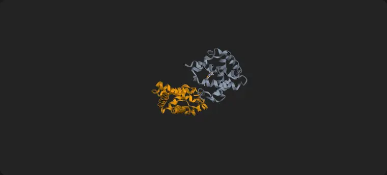

**Result.** 141 Cα pairs, 100% sequence identity, RMSD 0.335 Å — the prediction sits almost exactly on the crystal structure. AlphaFold DB numbers this model from the initiator methionine (1–142) while the crystal chain starts at the mature valine (1–141); the sequence-aware matching pairs them correctly regardless, and the RMSD is over those pairs.

**When a model has floppy ends,** set **Fit on → A chain or residue range…** (for example `A:94-292`) so the
disordered parts do not drag the superposition. The table then reports the RMSD over the fitted region and
over every matched residue, side by side.

---

## 3. Explore a complex

*How is this assembly put together, and where do its ligands sit?*

<picture>
  <source media="(prefers-color-scheme: dark)" srcset="images/use-cases/complex-dark.webp">
  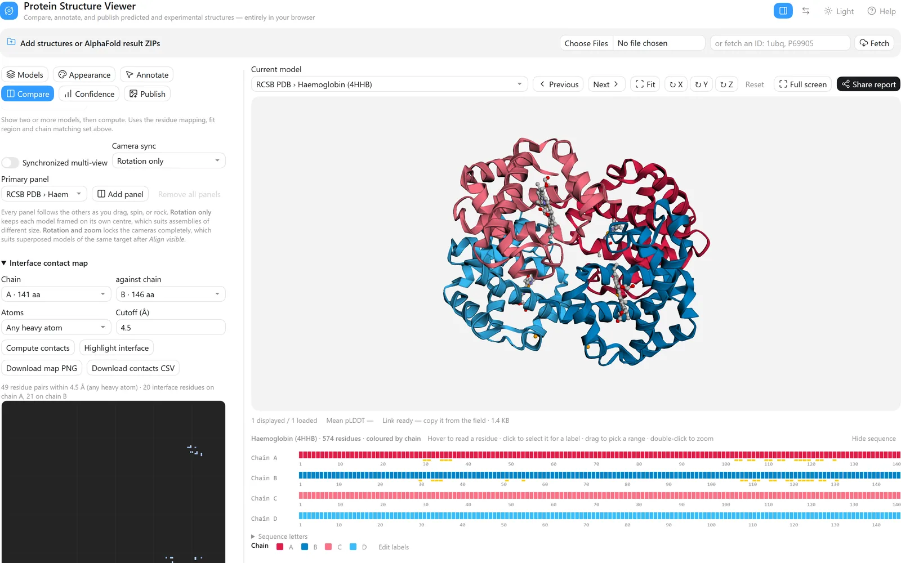
</picture>

**[Open this example ↗](https://mbaffour.github.io/protein-structure-viewer/#scene=z.jVVLb9w2EP4rweTSAtRC1GP1uNnOwYcWDZIghwY-cKmRxIYiVZLyo4b_ezCUdu113KK7F3Ge33wzHD5CeJgRWpidDahMcqvwDl3iJRoEBl6OOImv6LyyBlrOYDU4SSDbFftdDgykQxGwuwgkTLN9kjYJr77wqi3qtih2TdX8SRFH4bCDNrgFGaW9RSOMRGgfIaigCQyZ2cXJ7XvCMNpu_TY2oKfPJwaT7VB7aL89ghETGRfjeNhJ1QODHoMcNxEQbK8OFHzNK622Dlp4Xx9K2e-BgRYH1NDCtcDJDtoelHn3S3F9ffkrMBhV16G5GoUylO_m6YaBxxCUGTwBJ1J-tx1B8MoMmqhzODv0aIIIK1NSuGCtgS37Zi8pKGzF_OE6JFjaig47YCC0GsyEJhyj498LElsvVBfzrBVR2gvtkYGQQd0iOehzShz26Mj7DZ3Q-hN61S34GxHhT9FmZ_9CuZUwo_MzxvjAwC5BK0OwjI3T0tvh5Bf5_BweYkMP9j6Wo3FA0320Xm0BDzYEOyUa-0C8RIIvH54NtmC9Cp-ljYMqtIYo-ITDGgMYzJvD1RJs30NbksWwuFMxj09b9CuiPvbsgtqPnHdFDQyu6NQfKl6XwOCSTmlWF7ICBh_olNeHrq9p7NbIl4vSsVmP1M5losGAjIoQM0Hxa3VjrDoEpKTr7K0knI7CyVEFlGFxuBV8SvIFp1mLEC_H-2G-TWZhUCfnCaPisMJJfs5-pn4F5ZXuDNeZ7g2QmwXez9aFZFrnc3bKhGPSeEjuVBfoIvKqPlfIxQc7kSZLzzUiDhlpduW5ppsVtJCnrxwC3pP5KcEGyqt_CBSv0_SeZ89OR7UUcTpPJKpJDJj01k2Cws1meOWxUnTG0CpK5n-b6WgUMyUHQXf7hGJtcdJbQ8kunBKavbtGfYtBScHeeWF84tGpnqbuIOT3wdmF0kNwwvhZOIxkP6uujmutj791c-ElansHbcpgxIDO0h4JSn6nNbu4XsgXV9iT_cNn1T232T8Yua0fZ7dtRlPchzf2iLQT4fpIcxpXJV2ICZ2A9lvC011eNFVepEVRVU2WZizh-S4r91leFmlRN_u8Zkne7Jq8LPf7uiyaJi0LluzTXVrkVVllTV7u9zlL45_fPG2bZsvlUa_Lan0WpjcAxn3bwkVciHHjkW2espyzvGB5yfI942nOeFowntJ3xThPGeeccZ4zzgvGOclqxnnDeJYynmWMZznj2f5m3cBxFEY1jFoNY4AXT04vpOQlPLH_xHf5M758w1dyVpaMpzXjabPByhjnJeN8_wakgvGsZDyrGM9qxnP-vyHe0OMr_OKQHpqN4w3VBxEEtGbRmkFnp-PTyEAYs43JJjjejWOPxC12XxXerU_pDw)** — human deoxyhaemoglobin (PDB 4HHB), two α and two β subunits and
four haem groups.

1. Fetch `4hhb`. **Models → Composition** lists every chain with its length and range, the stoichiometry
   (α ×2, β ×2), the Cα extent and radius of gyration, and the ligands (HEM ×4, PO4 ×2).
2. **Colour by → Per chain**, then click a chain's swatch in the Composition table to give it the colour
   that means something — here α subunits in reds and β in blues. Double-click a swatch to go back to the
   palette; **Reset chain colours** resets them all. The colours are saved with the session and carried by
   share links.
3. **Compare → Interface contact map:** chain `A` against chain `B` → **Compute contacts** draws the
   residue-pair map; **Highlight interface** marks both sides on the structure. Here that is 49 residue pairs within 4.5 Å — 20 interface residues on chain A and 21 on chain B — marked on both sequence strips.
4. **Confidence → Ligand sites → Analyse ligand sites** lists every bound group with the residues around it
   (six sites here); **Highlight** shows a pocket on the model.
5. The **Shown** and **Faded** switches hide a chain or dim it into the background, so one interface can be
   the subject of a figure without deleting anything.

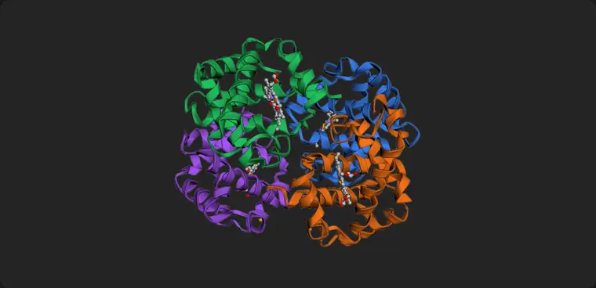

<picture>
  <source media="(prefers-color-scheme: dark)" srcset="images/use-cases/complex-sites-dark.webp">
  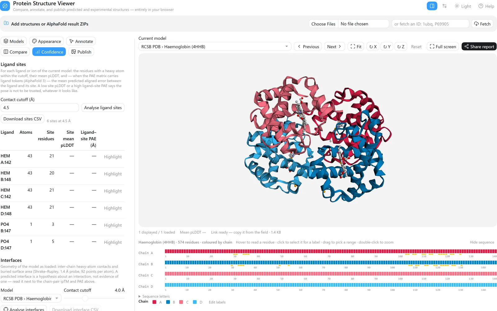
</picture>

---

## 4. Annotate domains and residues

*Mark up the regions and residues I care about.*

<picture>
  <source media="(prefers-color-scheme: dark)" srcset="images/use-cases/annotate-dark.webp">
  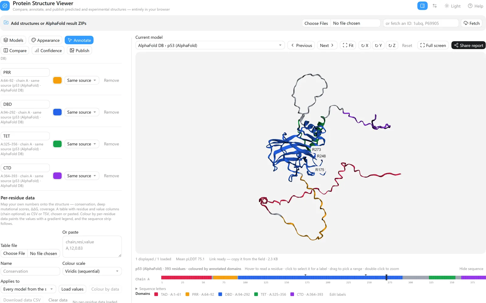
</picture>

**[Open this example ↗](https://mbaffour.github.io/protein-structure-viewer/#scene=z.nVdNj9tIDv0rQc1lFnhuFMn69K3T2WAPu9ggacxhgxzUctmtGVnySnIn2Ub--4CSupPOJgEm9kUqsshXJN8r-95MH0_FbM1p6KfSdJu7prwvw2asS1cMzFjflmP1WxnGpu_MlmAWh8cVwxcuXIiBqYdSTWV3Oemi5bCxeUPxmuLW5a24i-joPxrxthrKzmyn4Vygae9KV3V1Mdt7MzVTq2DUrT8P9fp8LNNtv1ueu34qoz5-gjn2u9KOZvv23nTVUZ0vX25eWRckbl7SRd3sDcy-TPXtVyajxxibG0224Kj7th_M1vySbny9DwamrW5Kq4Xx8uzXy_Z0W73s293fDMxts9uV7uq2ajpN_u7TO5ixTFPTHUY9hVboX_1O8YxNd2i1jkM5DWUs3VRNS9nqapj6vjNr6tW_6rp-0iqa9XT_HnZFcbV9tZtXq7Y5dMfSTQ8Zyn_PRcv3henydGobrfG-ascCU9VTc1d0Q_vtGg1lXwaN8gOfqm1fl7HZncs_tTLjY_TT0P9e6vVYpzKMpzLnMzD9eWqbTmF2_TxO-_7wuG8u8Jvp49zxm_7DfLy2HEq3e9WPzRrwpp-m_rhpy37SWs1Ff_7xs8MabN9Mb-p-nuSqbc288LoclhgG5rRuuDpP_X5vtl49Dufh8TD3n9boV9qOdWFxeX5u2rkL99qr81G7bljRVCeNOS4wb2f401R09zJVy2keX6uhvm2mUk_noazIH5Ncl-OpraaZBr8cTnebU9WVdvM04Wy4WeBs_j_7E_NXUL6yPcH1xPYNkKtH-XDqh2lzXAbvNDTd9JB0ftm8b3aTUo1iemqoz-PUH9XC9qmlmqdFLRf-qWV3aszWiP1qw1Q-qPtjghXU2PxPQVGy9gPx500P5rqax-yxiM2xOpTNvh-OlYY7dYevdiwlelKhZWlz-t5wzk5zps1NpaR9RLG0eLPvO012OTRVi2f_KO1dmZq6wrOx6sbNWIZmr7J2U9V_HIb-rOnNNFTdeKqGMhf7s-nqQbD282eRpfK8tP17s7Uwt2UqQ68CMTX1Hyqo52Ff1V9wcVT_j2-a3ec2jx-7etWVoV-lSqd4P_1AGOr-qPhe6bzOeqjEOJahMtu3G75gytZ5xy5JCNZ5bOiCybvgrGdO0UcXEC9s8MLWp8TiOWdsWOJF4EiUfPLR5Rhh5y-9-7SKxyL9xx9AU0Krada4sTFbih6mWobxSpfXeXpN0ZtP-IvR2KVvR2OXfiJalO9Ei2KWS6ZdhHYt87FU43koKvnryrAo9Itqqsy2O7ctzK4_rhfV4y15ffnCfHHlFaKdS9-AtDvrVfuWwBA4eAREJGSQBRGIQQJyIA8KoAhKoAy2YAIzWMAO7MEBHMEJnCEWQhCGCMRBPCRAIiRBMpyFIziGEzgH5-ECXIRLcBnewhM8wwu8g_fwAT7CJ_iMYBFIy7ReBOtPCHy_C9qitSavXr_-siZ7n4u9-X5NgkPwCAEhIiSEjGgRCZERBdEhesSAGBETYkaySITESILkkDxSQIpICSkjW2RC5p8F_-L5k4ayD1J-AD47ZI8ckCNyQtaGWpAlkGWQFZB1IOtBNoBsBNkEshk0d55A2nttvnZf26_91wHQCaAMYgtiHREGsYDYgdiDOIA4gjiBOIPEgoRAorMkIHEg8SAJIIkgSSDJIGdBjkCOQU6HzoGcB7kAchHkEshlkLcgTyDPIC8gr9PpQT6AfAT5BPIZFCwoECgwKAgoOFDQMQ6gEEEhgUIGRQuKBIoMigKKDiohFHXeIygmUMygZEGJQIlBSUDJgZIHpQBKSowEShmULSgTKDMoCyg7UPagHEA5grIySClkwZbAlsFWwNaBrQfbALYRbBPYZjAp1whMDCYBkwOTB1MAUwRTAisllZMzKRmstFReKjGVmUpN5SZnsFiwEFiUvQIWBxYPlgCWCJYElgx2FuwI7BjslOYO7DzYBbCLUGFkl8Hegj2BPYO9gL3qgQf7APYR7BPYZ3Cw4EDgwOAg4ODAQYUjgEMEhwQOGRwtOBI4MlQuOTpw9OCoChPBMYFjBicLTgRODE4CTg6cPDgFcFIpSuCUwdmCM4F_nnvXf7_-knsUKnHV97kn7CEcIBwhnCAqiaqJKoqzKgpEdVGFUZVRpVG1UTLEWYgjiGOIU_l0EOchLkBchLgEcRniLcQTxDPEC8SrznqIDz97yqvrJwqTRaT86JTBQYJKe4CECAkJEjIkWkgkSGRIFEh0kOghUe-ACIkJEjMkWUgiSGJIEkhykOQhKUCSXhYJkjIkW0gmSGZIlr92und4-L_1-Up9-HG3vo7VXdn91pT3yx-9PwE)** — p53 with its domains named and three cancer hotspot residues
labelled.

1. Fetch `P04637`.
2. **Annotate → Domains:** give a name, chain, residue range and colour, then **Add domain**. Here: TAD
   1–61, PRR 64–92, DBD 94–292, TET 325–356 and CTD 364–393 (approximate boundaries from the literature).
   **Applies to** decides whether the domain belongs to this model, to every model from the same source
   (all five models of one AlphaFold run), or to everything loaded.
3. **Colour by annotated domains** paints them and adds them to the legend; **Label domains** puts a label
   at each one.
4. **Go to** `A:175` selects that residue and zooms to it; type the label text (`R175`) and press **Add
   label**. R175, R248 and R273 are among the most frequently mutated positions in human cancer.
5. Drag a label to move it — a leader line keeps it tied to its residue — and **Reset** puts it back.
   **Download architecture PNG/SVG** draws the domains as a linear diagram.

Also under **Annotate**: highlight residue ranges in any colour, find residues near a ligand or chain,
search a sequence motif (`N[^P][ST]`), colour by a per-residue CSV of your own data, draw arrows and add
corner titles, and compare one position — a mutation, say — across several models.

---

## 5. Build a publication figure

*Get a figure out at the size and resolution the journal asks for.*

<picture>
  <source media="(prefers-color-scheme: dark)" srcset="images/use-cases/figure-dark.webp">
  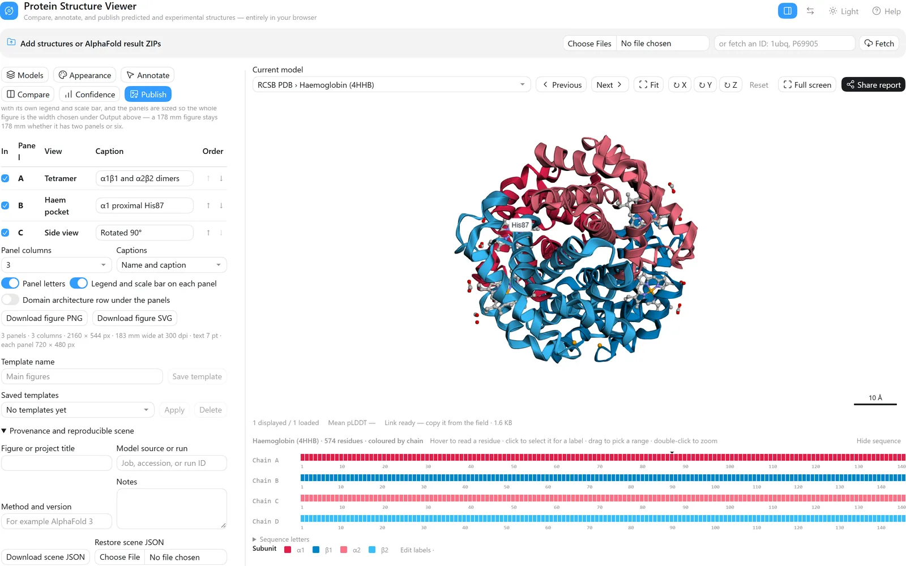
</picture>

**[Open this example ↗](https://mbaffour.github.io/protein-structure-viewer/#scene=z.7VbNbtw2EH6VxfjSApSgf2l1s52DDw0axEEODXzgSqNdNhSpkpR_6vidmjxCH8DPVAyl3Y1cN2iBpr1kT-IMOTP85uM3ew_ubkCoYTDaoVDBtcAbNIFtUCEwsM0Oe_4WjRVaQR0zmDYcLJCEWRGmwKAxyB22p46MUVIE0TqIyzdxWedRnaVhkkU_UcQdN9hC7cyIjNJeo-KqQajvwQknqRjapkfTzN89up1up2-lHVr6fGDQ6xalhfrdPSje0-Zst9uEjeiAQYeu2c0moLKt2FDwKW-jpTZQw0m1yZuuAAaSb1BCDRcce72VeiPU6rvs4uLse2CwE22L6nzHhaJ8Vw9XDCw6J9TWUuEEykvdUglWqK0k6AwOBi0qx92EVMON01rBnH3e31BQmC_zo2mRypKat9gCAy7FVvWo3D46_jIiofWZ63QYpCBIOy4tMuCNE9dIB-QSEoMdGjr9jI9L-RqtaEf8gYCwh2iD0T9jM19hQGMH9PGBgR6dFIrKUtqzpdPbwzmP56W78w3d6Ft_HYlbVO0rbcUccKOd030gsXOEiwf47O64YQ7WCXfZaE9ULiV4w2vcTjGAwTAfOB-d7jqoc9qxHc3hMvdT7A97hl2Om1GJQ84Pp1DD48f4sD6j9afj-tz7k8P6hfcnxEJvOKeO-jwU6QTjuM0qYEDnTrpNGVc5MKCoJ1FSZU0JDCjGSVpt2q6iOFPBZ6OQngP3xJKxJ76Bf158oBvaCbSdB9M5pKQTpSdsD0tump1w2LjR4IzjIckb7AfJnX9zJ9vhOhi4QhksE3rHZion-HP2hftJKU98i7oWvmeKnHfg7aCNC_qJ9oMRyu2T-kVwI1pH77sZrdP90jfbaoirdOnhnr7kCfOlpx0EXTyKlmaHt7S9hGVdVvyKPn4U3cbJ8dDe3XBPs2RvFz3fYtBp03MKN6jtkxMTSguQJlMw_NVr8Zt8pmDDSTXiQxlTm4NOK8p2agSXbHWB8hqdaDhbWa5sYNGIjpi34c37rdEj5Ycbagh8bjzfa2Xnf5Mc4hlKfQN1xGCHDo0mcXKieU_aPZqON5_pgqX9d5eiPTbZ3qlm1jSjZ4kkDnfuGXFqdD9wg6-IpV5_6Tn0aDjU74I4CtNsXaZZlGVluU6ihAVxGiZ5kaR5FmXVukgrFqTrcJ3meVFUebZeR3nGgiIKoywt8zJZp3lRpCxiUVhGZRwVZRXHVZFnZf6csbh6mAVumj79MyV7Wa_h1OuuFVBXJQM-0fKcrDOzLoStSpgGipyEdr5ij9yOBkniZ4uZFPoFdxxqNUrJoNX9figx4ErNWM6GPXfmpeXX2L4VeLMYmm_QGULzKDKTGD5-ildctavHj8njp2TVip6e-NeDnkUsvvrC-JpH-Mv91D_6ruaR6gX4YD1OdxI-P1AX7r0m_gvD-wtD8h8_rq_wWLy8n_u2TX9f2KH59HdnNejmPbqn_V8NRt-KnsvVxNFF57MwKfJyffyxIInDvEjoIw3LdVWwPA-TPMmipMzWWVUl35r8PzWZ8qwIgUWLX1MWbFfr6PffvuKz_puK-o0T_wUnrh7-AA)** — haemoglobin with three saved views, ready to export as a
three-panel figure.

1. Set up the scene: colours, labels, **Appearance → Background → White**.
2. **Publish → Edit figure labels** renames what the legend says without touching the data — here `Chain`
   becomes `Subunit` and A–D become α1, β1, α2, β2. With chain colouring on, each row carries a colour
   picker too.
3. **Journal preset** sets width, resolution, text size and font in one choice (Nature double column:
   183 mm, 300 dpi, 7 pt). Add a **Scale bar** of known length.
4. Arrange the view and press **Save current view** once per panel, with a name and caption.
5. In the **Figure builder**, tick the panels, order them, choose the columns and press **Download figure
   PNG** — or **SVG**, where labels, captions and legends stay editable in Illustrator or Inkscape. PNG and
   TIFF carry the dpi in the file; PDF carries the page size.
6. The **Publication checklist** flags problems before a reviewer does, and **Write figure legend** and
   **Write methods text** draft the words to go with it.

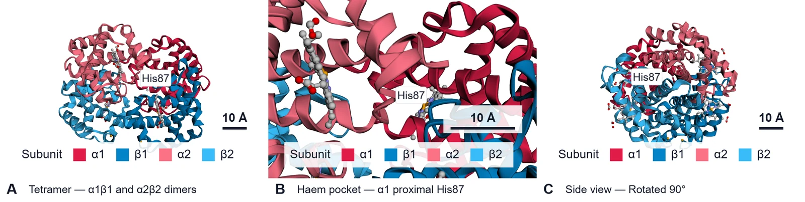

*The figure above is the file the builder wrote, unedited.*

---

## 6. Share your work

*Send a collaborator exactly what I am looking at.*

<picture>
  <source media="(prefers-color-scheme: dark)" srcset="images/use-cases/share-dark.webp">
  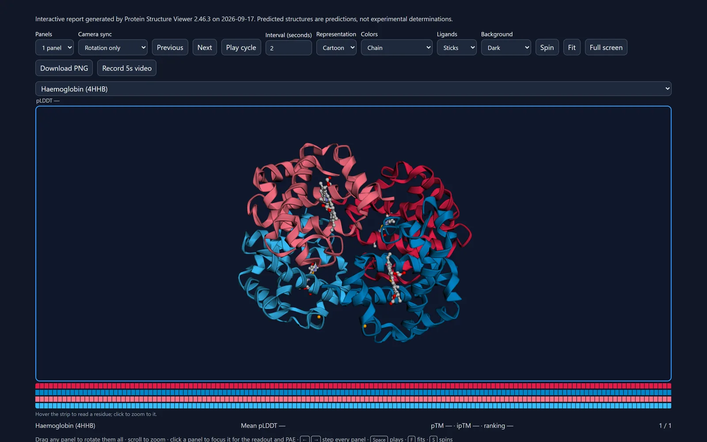
</picture>

**[Open this example ↗](https://mbaffour.github.io/protein-structure-viewer/#scene=z.dVVNc9s2EP0rns0lnQE1_JQo3izn4EM7zcSZHJrxAQSXJBIQYAFQtuvxf-8sCMmR69oXAvvx3r5drJ7BP80IDczWeJQ6OUp8QJs4gRqBgRMjTvwbWieNhiZjsDqcbyDflNtNAQyERe6xu_Z0mebbJN0n2e5rtmuqrMnzTV7Uf1HGkVvsoPF2QUawR9RcC4TmGbz0isiQm1msiN8T-tF067c2Hh19vjCYTIfKQfP9GTSfyLkcx3YjZA8MevRijFdAtJ1sKfmKK4wyFhr4ULeV6LfAQPEWFTRwy3EygzKt1Fcfy9vbw2_AYJRdh_pm5FIT3v3LPQOH3ks9OCJOovxhOqLgpB4USWdxtuhQe-5XpQS33hgNET36C0oKsZg_bYdESxneYQcMuJKDnlD7U3b8e0FS6xfT9TwrSZL2XDlkwIWXR6QAdSmJxR4tRb9j40p9QSe7BX8nIdw522zNDxSxhBmtmzHkBwZm8UpqoqVNmJbeDOe4oOedfwoNbc1jKEfhgLr7bJyMCVvjvZkShb0nXYLAh6dXh5isl_5OmDCoXCkIF19wWHMAgzkG3Cze9D00FXkMiz0X8_wSs9-Q9KFn19R-zLKurIHBDZ36dpfVFTA40CnN61LsgMEnOhV12_U1jd2a-bBIFZr1TO1cJhoMyKkIPhMVt1Y3hqq9RwJdZ28V4XzkVozSo_CLxVjwGeQrTrPiPjyOD8N8TGauUSWXgMHQrnSS_6JfmN9QeWO74HVhe4dk9MDH2VifTOt8zlZqfwINh-RBdp4eYrarLw1icd5MZMnTSwsPQ0aWTXVp6WYJDRTpmwCPj-R-BoiknPyHSGV1mj5m-WvQySx4mM6ziHLiAya9sROndLMe3kSsEl0otF4l8__NdHAKSEnL6W2fWawtTnqjCezaSq7Y1S2qI3opOLtyXLvEoZU9TV3Lxc_BmoXgwVuu3cwtBrFfTTentdaHv3Vz4QGVeYAmZTCiR2toj3gpftKaXWzPxS9P2JH_053sXtvsnrSI68eauM1oinv_zh4RZiJen2lOw6qkBzGh5dB8T7J0U5T7XVGmZbnb7fM0Z0lWbPJqmxdVmZb1flvULCn2m31RVdttXZX7fVqVLNmmm7QsdtUu3xfVdluwNPxn9y9x00Qsh2pdVvE8IXeLRVqT8cauW-4T9xwavSjFoDPTabEz4FrHIuPFqbMnBH7E7pvEh_WH4F8)** — a share link: the models are refetched and the scene restored.

- **Copy share link** (Publish) puts the whole scene in a URL: models fetched by ID, camera, colours
  (including custom chain colours), labels, annotations and saved views. Files opened from your computer
  are never put in a link; share those with a session file or a report instead.
- **Share report** writes one self-contained HTML file with the models inside it. It opens in any browser
  with no install, keeps its own controls, sequence strips and confidence readouts, and can embed 3Dmol.js
  to work offline. This is the thing to attach to an email or a review.
- **Save session file** writes a ZIP that reopens everything, including local files and PAE matrices. The
  page also autosaves: reload it and it offers to restore where you were.

<picture>
  <source media="(prefers-color-scheme: dark)" srcset="images/use-cases/share-link-dark.webp">
  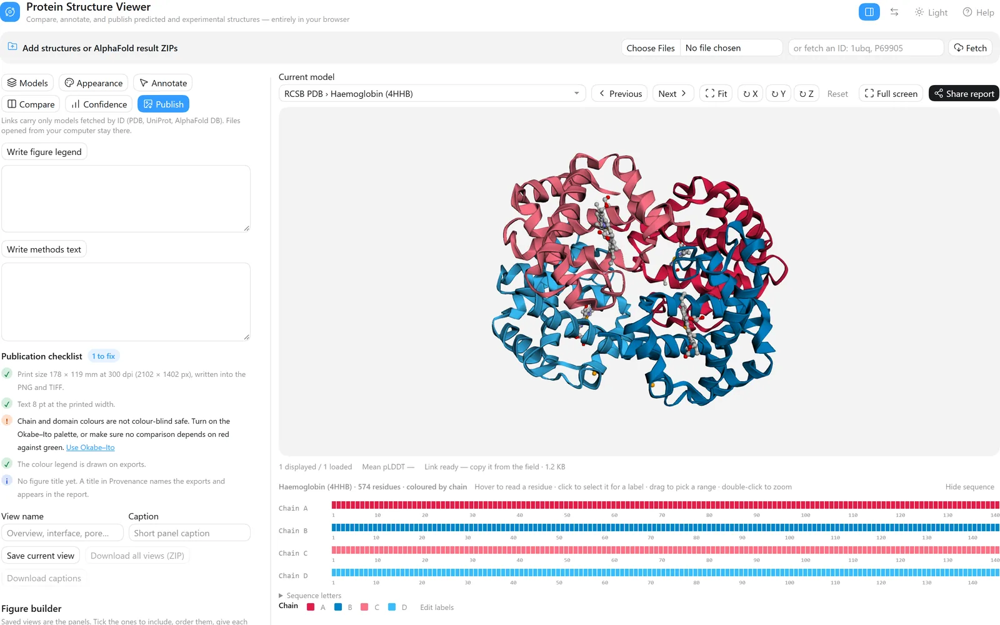
</picture>

---

## 7. Compare many models

*Which of these models agree, and where do they differ?*

<picture>
  <source media="(prefers-color-scheme: dark)" srcset="images/use-cases/ensemble-dark.webp">
  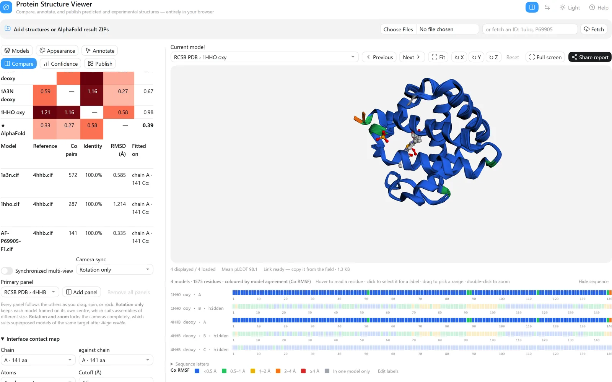
</picture>

**[Open this example ↗](https://mbaffour.github.io/protein-structure-viewer/#scene=z.lVVNb9s4EP0rwfRKGfqwZFs3J0WQw-42aIoetsiBpkYWtxSpJSkn3iD_vRiKdmy3DbD2hZwPvsfhzNML-P2AUMNgjUepk53EJ7SJE6gRGDjRYc-_onXSaKgzBlPA0QL5bF7NCmAgLHKPzdqTMc2rJF0l2eJLtqjLvJ6Xs6Ja_E0ndtxiA7W3IzKC3aHmWiDUL-ClV0SGwsxoRVz36DvTTGttPDpavjLoTYPKQf3tBTTvKXjedZuZkC0waNGLLpqAaDu5ocMnXGGUsVDDh-WmFG0FDBTfoKL4u7vrqwbN8x4YdLJpUN90XGrCgWtgcAMMPsLjKzuiZrzQF6hkegc1rTZVMz9BzdbFX_8XtevMJWrXmXdQ29WiyE7vmt3dfbr6HeYp1vo2ua9Wq7RMbrMLzFPXO9h5LsoST7DXauj4rVHNz-CPr48MHHov9dZRX1DP_WkaYmJ2aBUnxhYHiw61537qRMGtN4bKHlBjAt9axB61h9gwn2yDREkZ3iChcyW3miJihsN_R6SOPHGth0HJt7blwssdUrw6fwmLLVpKPvhOOpIr9RmdbEb8g2rgoG65ctMQ_IMi3mJA6wYM5wMDM3olNbHSJgxka7bHvFDKB78PM7Mxz-E2Creom3vjZDxwY7w3faKwpRKIUOTr_VtAPKyV_kGYoAUWtzLUsZX-87SuYQ0Mhph0M3rTtlCXFLId7fFCL68R4YZeIBqmkOtRqlD4F3qesaeXhpwY8YHOdBPVLlzBe6TsqdjTjY5bbkUnPQo_WozsjyBfsB8U90FMPmyHXTJwjSo5BwyOzUQn-Rn9zH1B5cJ3xuvM9wuSMQKfB2N90k-9NlgZOnMiS5vkSTY-DPNiee4Qo_OmJ0-ennt46BjyzMpzTzNIqKFILxI8PlP4ESCScvK_oCzLNH3O8rekg1vw0GrHIsqebzFpje05HTfo7UXGVKKzCk2mZPhdg4aggJRsOM3pkcX0xElrNIGtreSKXd2h2qGXgrMrx7VLHFrZ0sdhw8X3rTUjwYO3XLuB20kG3lw3R2kMv0mK8BqVeYI6ZdChR2tIE7wU3-mzNNqWi5N5dBS_f5DN2zO7vRZRSqyJ6kRd3PpfiIIwPfG6pz4N2kcD0aPlUH9LsmK2yJZpUaVZVharLGdkKvJqnq6yIpsv83lZsKRYzlblqliW5bwqVnlRsHJWLfJymVZltVjmi2zB0vDPHl-jbEQsh2pSnrjvkbvRBr2MFjtJ1kfuOdR6VIpBY_qDUjPgWsdLRsPhZQ8IfIfNV4lPk7L_AA)** — human α-globin four ways: two deoxy crystal structures (4HHB,
1A3N), an oxy structure (1HHO) and the AlphaFold model.

1. Fetch `4hhb`, `1a3n`, `1hho` and `P69905`. Hide every chain except **A** in the three crystal
   structures and choose **View mode → Overlay selected**.
2. **Compare → Fit on → A chain or residue range…** `A`, pick a reference and press **Align visible**.
3. **Compute matrix** gives the pairwise Cα RMSD between every pair; **Use medoid as reference** re-fits
   everything on the model that sits closest to all the others.
4. **Colour by → Model agreement (Cα RMSF)** colours each residue by how much the models disagree there;
   **RMSF profile** plots it per residue.
5. For an AlphaFold run, drop the ZIP: all five models load with their ranking, **Model order → Ranking
   score** sorts them, and **Cycle models** flips through them.

**Result.** Fitted on chain A, the AlphaFold model sits 0.33 Å from 4HHB, 0.27 Å from 1A3N and 0.58 Å from the oxy structure 1HHO, and it is the medoid — the model closest to all the others. (The crystal structures' own pairwise figures, 0.59–1.21 Å, count every chain they match, not only the chain fitted on.) Model agreement then says where they differ rather than by how much overall: 135 of 141 residues agree within 0.5 Å, and what stands out is the C-terminal Tyr140–Arg141 and residues 88–89 beside the proximal His87 — the parts that move when haemoglobin binds oxygen. Against deoxy 4HHB, the oxy structure's Arg141 sits 4.8 Å away and its 88–89 stretch 1.3–1.7 Å, while the second deoxy structure stays within 0.5 Å; the prediction, at 0.3–0.7 Å, sits with the deoxy pair.

---

More detail on every control is in the [usage guide](USAGE.md).
